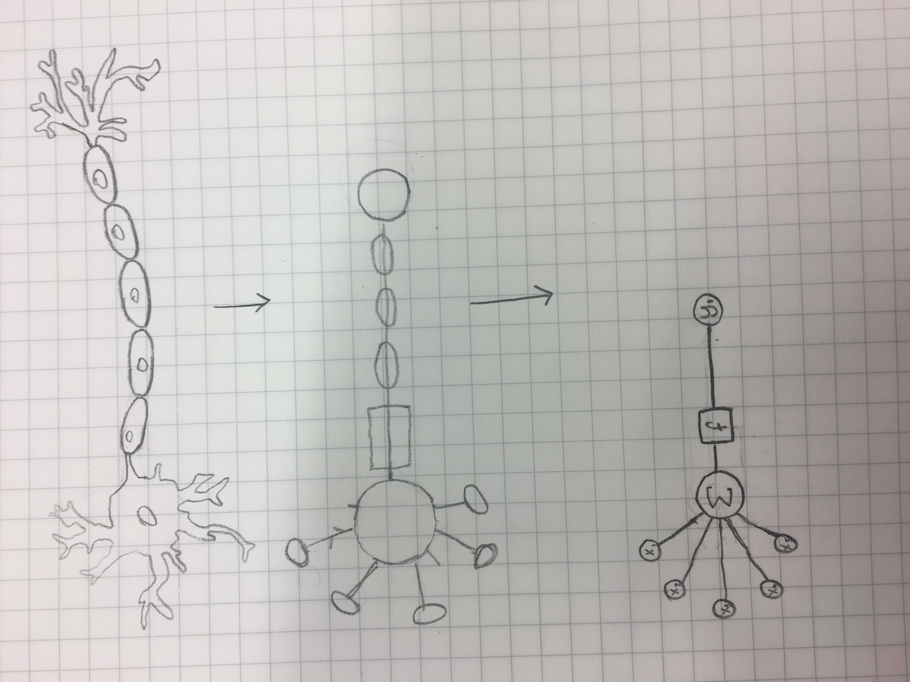

### Idea 101
Artificial Neural Networks are computing systems for machine learning inspired by the structure of biological neurons. An ANN is based on a collection of connected units or nodes called artificial neurons, which loosely model the neurons in a biological brain. Each connection, like the synapses in a biological brain, can transmit a signal from one artificial neuron to another. An artificial neuron that receives a signal can process it and then signal additional artificial neurons connected to it.
Typically, artificial neurons are aggregated into layers. Different layers may perform different kinds of transformations on their inputs. Signals travel from the first layer (the input layer), to the last layer (the output layer), possibly after traversing the layers multiple times.
Hidden layers can find features within the data and allow following layers to operate on those features rather than the noisy and large raw data. For example, in the task of finding human faces in an image, the first hidden layer could take in the raw pixel values and find lines, circles, ovals, and so on within the image. The next layer would receive the position of these lines, circles, ovals, and so on within the image and use those to find the location of human faces.
This is called supervised feature learning.

