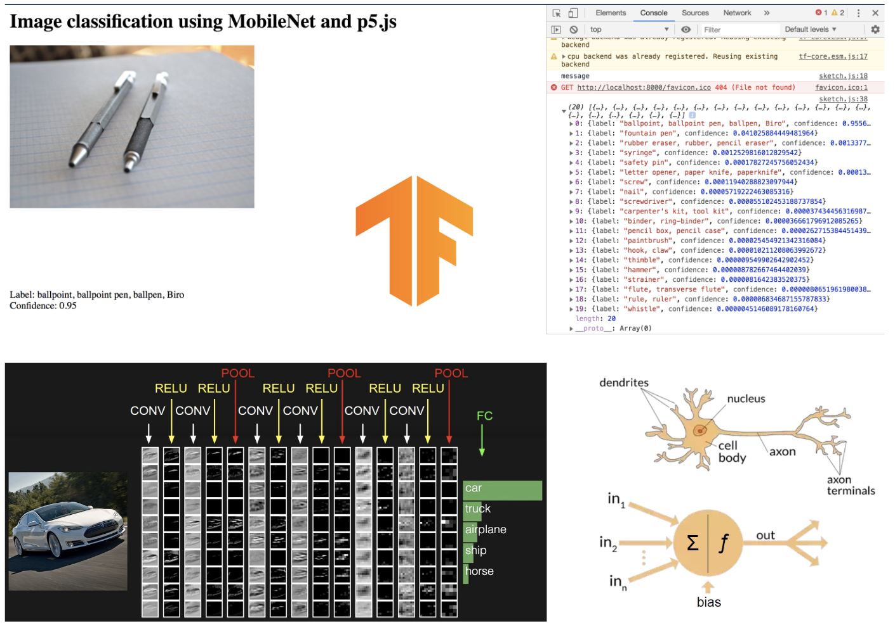

### Idea 101
Artificial Neural Networks are computing systems for machine learning inspired by the structure of biological neurons. An ANN is based on a collection of connected units or nodes called artificial neurons, which loosely model the neurons in a biological brain. Each connection, like the synapses in a biological brain, can transmit a signal from one artificial neuron to another. An artificial neuron that receives a signal can process it and then signal additional artificial neurons connected to it.

The idea of neural networks began as a model of how neurons in the brain function, termed ‘connectionism’ and used connected circuits to simulate intelligent behavior. Around the 1950s, Frank Rosenblatt, a psychologist at Cornell, was working on understanding the decision systems present in the eye of a fly, which determine its flee response. In an attempt to understand and quantify this process, he proposed the idea of a Perceptron in 1958, calling it Mark I Perceptron. It was a system with a simple input output relationship, modeled on a McCulloch-Pitts neuron, proposed in 1943 by Warren S. McCulloch, a neuroscientist, and Walter Pitts, a logician to explain the complex decision processes in a brain using a linear threshold gate. The beauty of Mark I Perceptron lay in the fact that its weights would be ‘learnt’ through successively passed inputs, while minimizing the difference between desired and actual output. Things started moving quickly for neural networks around this time and in 1959 at Stanford, Bernard Widrow and Marcian Hoff developed the first neural network successfully applied to a real world problem. These systems were named ADALINE and MADALINE after their use of Multiple ADAptive LINear Elements, the latter of which was specifically designed to eliminate noise in phone lines and still remains in use today.

Typically, artificial neurons are aggregated into layers. Different layers may perform different kinds of transformations on their inputs. Signals travel from the first layer (the input layer), to the last layer (the output layer), possibly after traversing the layers multiple times. For example, a Convolutional Neural Network is often used for simple image classification. This type of ANN uses convolution and pooling layers. Instead of feeding the entire image as an array of numbers, the image is broken up into a number of tiles, the machine then tries to predict what each tile is. Finally, the computer tries to predict what’s in the picture based on the prediction of all the tiles. This allows the computer to parallelize the operations and detect the object regardless of where it is located in the image.
Hidden layers can find features within the data and allow following layers to operate on those features rather than the noisy and large raw data. For example, in the task of finding human faces in an image, the first hidden layer could take in the raw pixel values and find lines, circles, ovals, and so on within the image. The next layer would receive the position of these lines, circles, ovals, and so on within the image and use those to find the location of human faces.
This is called supervised feature learning. It's also used for speech, handwriting, and face recognition.

