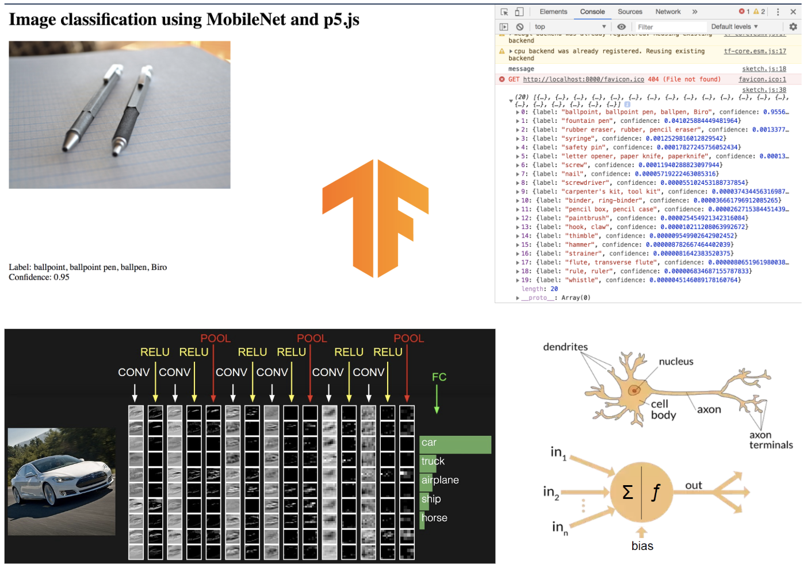

### Research

- Picture of a biological and artificial neuron
- 4/3/19

This is the image that caught my attention when I was researching ANNs. I think it helps illustrate how artificial neurons work and draws attention to the similarities between the two.

